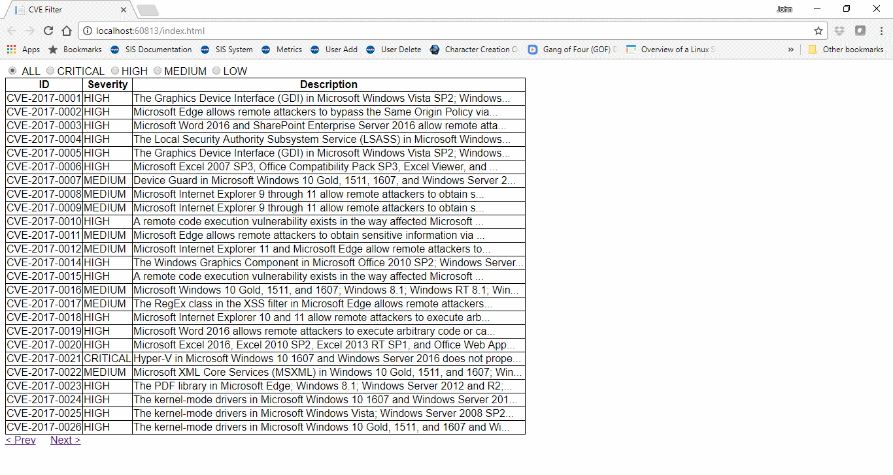

# CVE

This project is a way to view the NVD database via the web. I grabbed a version of the 2017 json data feed from here: https://nvd.nist.gov/vuln/data-feeds. 

This project will allow you to view the data in a paginated, tabular format, as well as allow you to filter vulnerabilities by severity.

In order to build this project, simply load the solution in Visual Studio 2017, make sure the "index.html" file is selected under the CVE Project, and run. All other defaults should be properly set for the site to work upon download.

Enjoy!
